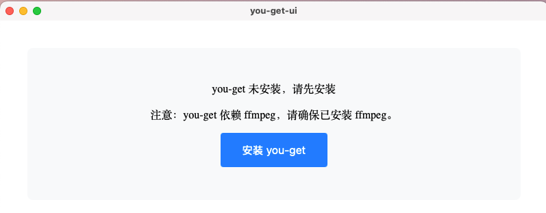
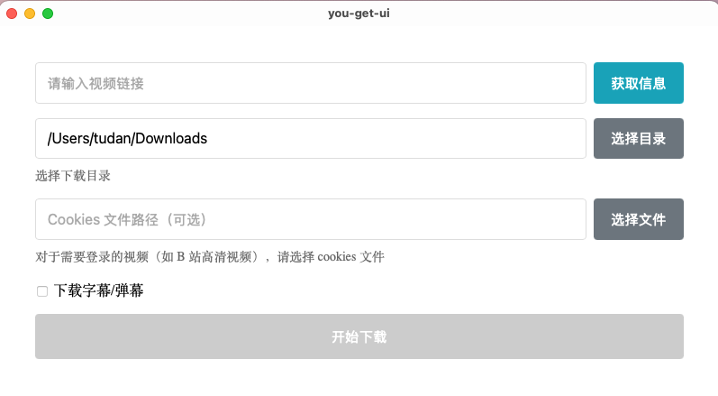
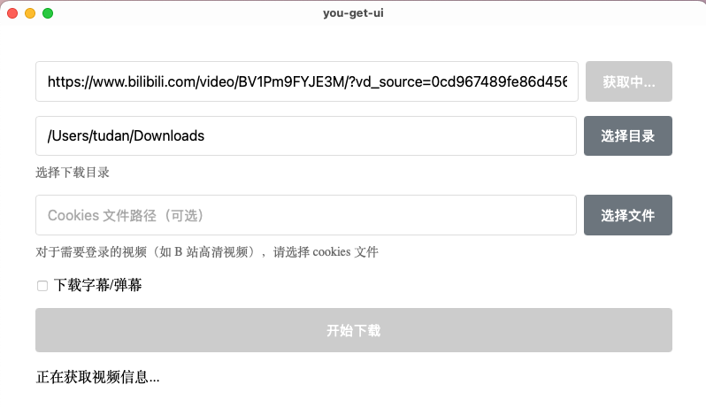
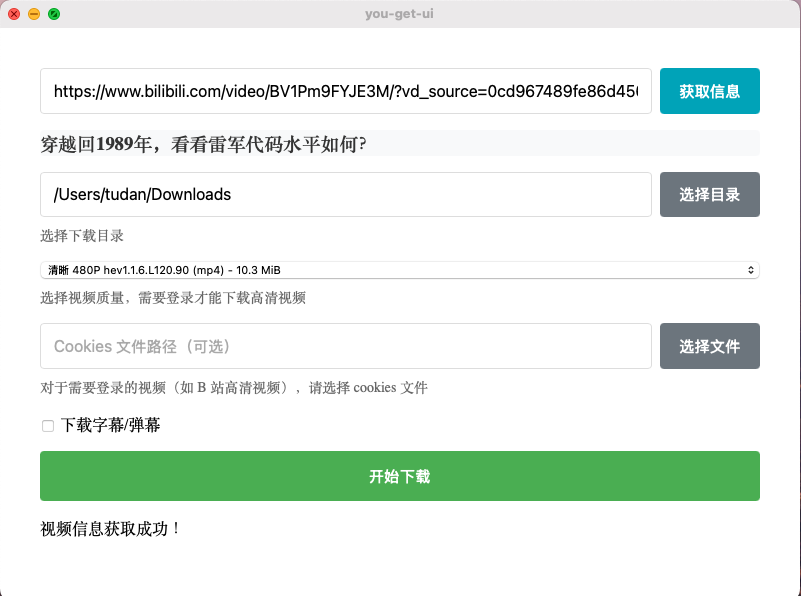
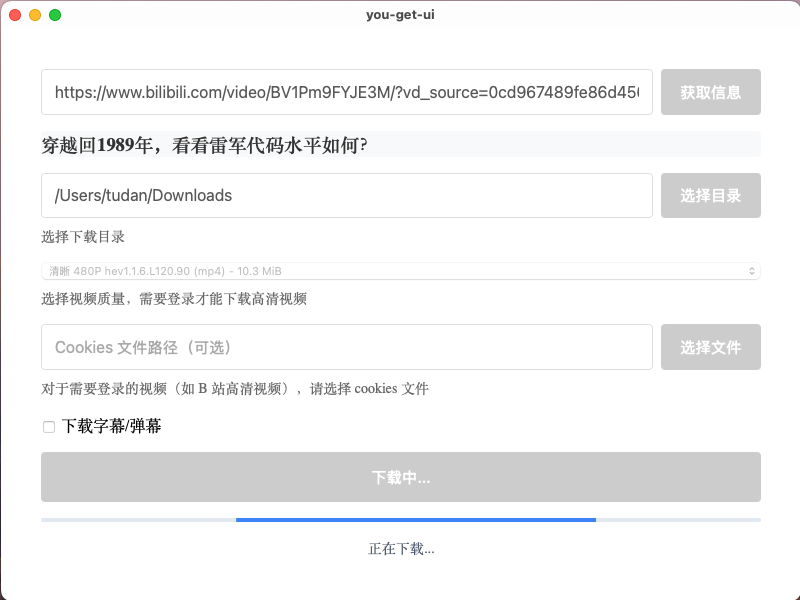

# You-Get UI

一个基于 Tauri 和 Vue 3 的 You-Get 图形界面客户端，让视频下载更简单。此项目为 tauri2.0 学习产物，不保证持续更新。

## 功能特性

- 🎥 支持多个视频平台的视频下载
- 🎯 简洁美观的用户界面
- 📊 显示视频信息和可用的下载格式
- 🔒 支持使用 cookies 文件下载需要登录的视频
  - 可以使用 Chrome 插件 [Get cookies.txt LOCALLY](https://chrome.google.com/webstore/detail/get-cookiestxt-locally/cclelndahbckbenkjhflpdbgdldlbecc) 导出 cookies.txt 文件
  - 支持 Bilibili 等需要登录的平台
- 📁 自定义下载路径
- 🔄 实时显示下载状态

## 系统要求

- macOS 10.13+ / Windows 10+ / Linux
- Node.js 16+
- Rust 1.70+
- Python 3.7.4+ (用于 you-get)
- FFmpeg 1.0+ (用于 you-get)
- you-get ( [https://you-get.org/](https://you-get.org/) )

## 安装

1. 克隆仓库：
```bash
git clone https://github.com/tudan110/you-get-ui.git
cd you-get-ui
```

2. 安装依赖：
```bash
# 安装前端依赖
yarn install

# 安装 Rust 依赖
cd src-tauri
cargo build
cd ..
```

3. 运行开发环境：
```bash
yarn tauri dev
```

4. 构建应用：
```bash
yarn tauri build
```

## 使用方法

1. 启动应用后，如果未安装 you-get，点击"安装 You-get"按钮进行安装
2. 在输入框中粘贴视频链接
3. 点击"获取信息"按钮获取视频信息
4. 选择需要的视频质量（需要登录的视频请选择 cookies 文件）
5. 点击"开始下载"按钮开始下载

## 支持的视频平台

- Bilibili
- YouTube
- Twitter
- Instagram
- 更多平台请参考 [you-get 支持的网站](https://github.com/soimort/you-get#supported-sites)

## 开发技术栈

- 前端：Vue 3 + Vite
- 后端：Tauri + Rust
- 视频下载：you-get

## 贡献

欢迎提交 Issue 和 Pull Request！

## 界面预览












## 许可证

MIT License
